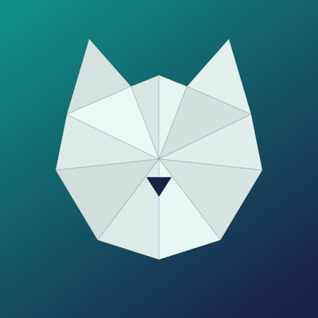
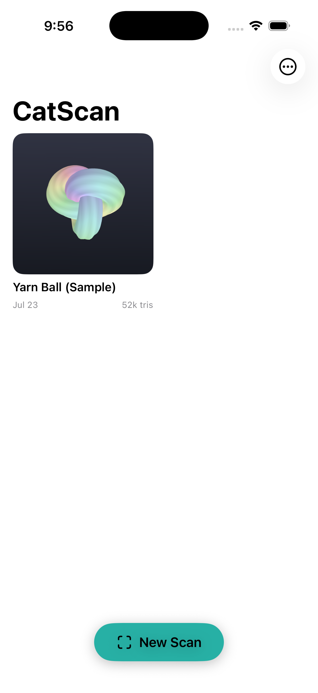
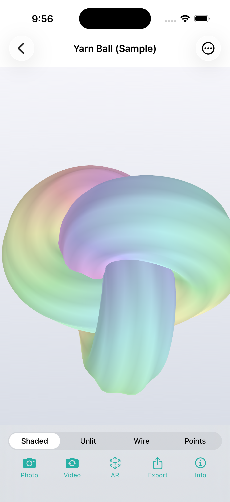
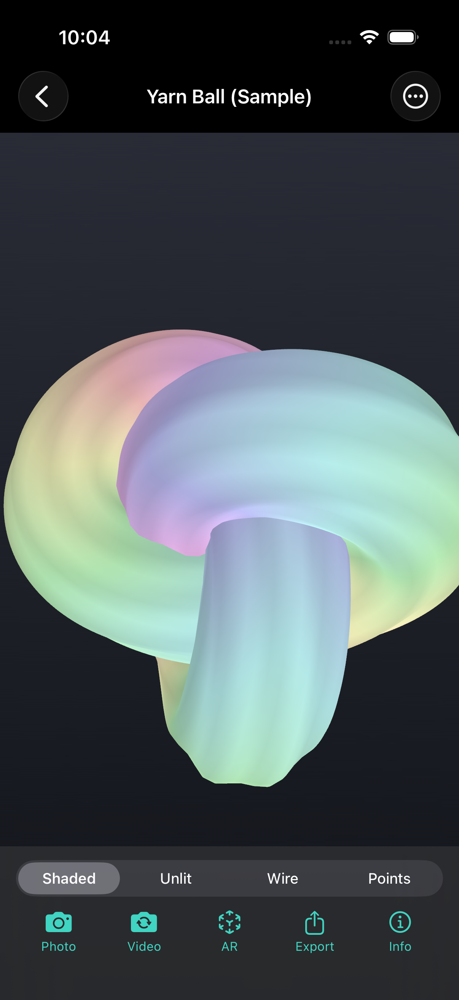

<p align="center">
  
</p>

<h1 align="center">CatScan</h1>

<p align="center">A fully featured, fully open 3D scanning app for LiDAR iPhones and iPads.<br/>
Scan the world, view it in 3D, export to standard formats, and share to Photos and AR.</p>

<p align="center">
  
  
  
</p>

## Features

- **LiDAR mesh scanning** — ARKit scene reconstruction with a live mesh overlay, tracking-quality hints, coaching overlay, torch toggle, and live triangle/color statistics while you scan.
- **Detail capture mode** — a second engine for small subjects: raw LiDAR depth frames are fused into a sparse TSDF voxel grid (4–8 mm voxels, chosen by capture volume: 0.5 m / 1 m / 2 m) and the surface is extracted with Surface Nets, recovering far finer geometry than ARKit's ~2–5 cm mesh. A teal box shows the capture volume; everything stays on-device.
- **3D Moments (volumetric video)** — a third capture mode records up to 10 seconds of colored depth point clouds at 15 fps. Play them back from any angle with orbit + scrub controls, and export a "spatial replay" video to Photos where the clip plays while the camera orbits it — footage from angles the phone never stood at.
- **Scan diffing** — any scan with a saved world map offers **Rescan & Compare**: the new session relocalizes into the original's coordinate frame, and the result gets a Changes view mode — green where geometry appeared, red ghost where it disappeared, with measured areas. Rental move-out documentation, renovation progress, "what moved?".
- **True color capture** — while scanning, every LiDAR depth frame is unprojected into world space and paired with the camera image, accumulating a quality-weighted sparse voxel color field. After the scan, each mesh vertex is painted from that field, so scans come out in color without any cloud processing.
- **Live coverage heatmap** — a scanner overlay mode that paints the mesh by color-capture quality: green where the camera has good samples, red where it has never looked. Cycle Off → Mesh → Coverage with the eye button and "paint the room green" for gap-free color.
- **Surface classification** — optionally labels faces as wall / floor / ceiling / table / seat / window / door, with a dedicated color-coded view mode.
- **Post-processing pipeline** — mesh chunk merging, vertex welding across ARKit anchor borders, color hole-filling, floater (disconnected island) removal, smooth normal recomputation, and optional vertex-clustering decimation (Maximum / Balanced / Compact detail settings).
- **Scan library** — thumbnails rendered offscreen, rename/delete, scan info (dimensions, surface area, triangle counts, color coverage, file size).
- **In-app 3D viewer** — SceneKit orbit/zoom viewer with Shaded, Unlit, Wireframe, Points, and Classes display modes, in light and dark themes.
- **Standard-format export** — OBJ, PLY, STL, glTF binary (GLB), and USDZ, shared via the system share sheet (AirDrop, Files, Messages, …). GLB and USDZ writers are implemented from scratch.
- **Single-file web viewer export** — export any scan as one self-contained `.html` with a built-in WebGL orbit viewer (embedded GLB + ~300 lines of hand-rolled JS). AirDrop it to anyone; it opens in any browser with no app, account, or internet.
- **Photos integration** — save viewer snapshots and rendered 360° turntable videos straight to your photo library (Photos can't store 3D models, so CatScan renders them for you).
- **AR Quick Look** — view any scan in AR, placed in your room, via the built-in USDZ pipeline.
- **Diff-ready captures** — each scan stores its `ARWorldMap` alongside the mesh, so future versions can relocalize a rescan into the same coordinate frame and highlight what changed.
- **Works without LiDAR too** — devices without LiDAR (and the simulator) can't scan, but get a procedural sample scan to exercise the viewer, exports, and Photos features.

## Requirements

- Xcode 16 or newer (project uses the folder-synchronized project format).
- iOS 17.0+ deployment target.
- **Scanning** requires a LiDAR device: iPhone 12 Pro or later Pro/Pro Max models, or iPad Pro (2020 and later). Everything else runs anywhere, including the simulator.

## Getting started

1. Open `CatScan.xcodeproj` in Xcode.
2. For device builds, copy `Config/Local.xcconfig.template` to `Config/Local.xcconfig` and set your team id (kept out of git) — or just pick a team under Signing & Capabilities.
3. Build and run on your iPhone (or the simulator for the non-scanning features — use **⋯ → Add Sample Scan** to get a model to play with).

CLI build:

```bash
xcodebuild -project CatScan.xcodeproj -scheme CatScan \
  -destination 'platform=iOS Simulator,name=iPhone 17 Pro' build
```

## How it works

```
CatScan/
├── App/            Library home screen, app entry, unsupported-device sheet
├── Models/         MeshData (+ compact binary serialization), ScanDocument,
│                   ScanStore (Documents/Scans/<uuid>/), sample mesh factory
├── Scanning/       ScanSessionController (ARSession lifecycle & delegates)
│                   DepthColorSampler (depth-map → colored world points)
│                   SpatialColorStore (sparse voxel color field)
│                   MeshBuilder (merge → weld → color → clean → normals → simplify)
│                   TSDFVolume (Detail mode: sparse TSDF fusion + Surface Nets)
│                   ScanDiff (rescan comparison: occupancy diff + speckle filter)
│                   MeshOverlayRenderer (live wireframe / coverage heatmap / volume box)
│                   ScannerView + ScannerSceneView (ARSCNView scanner UI)
├── Viewer/         SceneKit viewer + display modes, Moment player + spatial
│                   replay renderer, turntable video renderer, AR Quick Look,
│                   scan info
├── Export/         OBJ / PLY / STL / GLB / USDZ / HTML writers, export UI, share sheet
└── Support/        Photos saving, toasts, haptics, formatting helpers
```

Capture design notes:

- ARKit continuously re-tessellates its mesh anchors, so per-anchor color buffers don't survive a scan. CatScan instead keys color samples by **quantized world position** (8 mm voxels): each depth frame contributes ~49k colored points with a quality score (depth-confidence × closeness), and the best sample per voxel wins. At finish, each welded vertex looks up a quality-weighted blend of its 3×3×3 voxel neighborhood, and remaining gaps are filled from mesh-neighbor colors.
- Detail mode integrates each depth ray into a brick-sparse TSDF: samples march the ±3-voxel truncation band and splat into their 2×2×2 corner neighborhoods with per-corner ray distances and trilinear weights (depth rays can be sparser than the voxel grid, so nearest-corner updates would leave holes). Extraction is Surface Nets — one vertex per sign-changing cell — with triangle winding corrected against the SDF gradient. Debug builds verify the whole path with an analytic sphere (closed topology, exact area) and a synthetic depth wall (reconstructs within 0.1 mm).
- The USDZ exporter writes a USDA layer with per-vertex `displayColor` primvars inside a spec-compliant stored-zip container (64-byte aligned payloads). SceneKit's built-in USDZ writer was dropped because it silently discards vertex colors.
- The GLB exporter emits glTF 2.0 with `POSITION` / `NORMAL` / `COLOR_0` accessors and a double-sided material, so vertex-colored scans open correctly in Blender, three.js, MeshLab, and Windows 3D Viewer.

## Export formats

| Format | Colors | Best for |
|--------|--------|----------|
| USDZ   | ✓ (displayColor) | AR Quick Look, Messages, Apple ecosystem |
| GLB    | ✓ (COLOR_0)      | Blender, three.js, game engines, web |
| HTML   | ✓ (embedded GLB) | Sharing an interactive viewer with anyone |
| PLY    | ✓ (binary)       | MeshLab, CloudCompare, scan processing |
| OBJ    | ✓ (MeshLab convention) | Maximum compatibility, text-based |
| STL    | —                | 3D printing, CAD |

## Debug hooks

Debug builds understand two launch arguments (see `Support/DebugAutomation.swift`, compiled out of Release):

- `-catscanAutoTest` — builds the sample scan, runs every exporter, renders a turntable, saves to Photos, and writes `Documents/autotest-report.txt`.
- `-catscanOpenFirst` — navigates straight to the first scan on launch (handy for screenshots).

## Privacy

Everything happens on-device. CatScan uses the camera/LiDAR only while you scan, saves scans to its own Documents folder, and only touches your photo library when you explicitly save a snapshot or video (add-only access).

## License

MIT — see [LICENSE](LICENSE).
